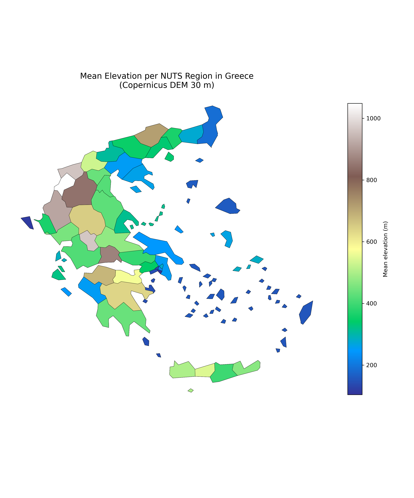

## Map Preview


# Zonal Elevation Statistics per NUTS Region in Greece

## Overview
This project computes **zonal elevation statistics** (mean, minimum, maximum, standard deviation)
for Greek administrative regions using **Copernicus DEM (30 m)** and **Eurostat NUTS boundaries**.

The workflow is implemented in **Python** and produces tabular outputs, spatial datasets,
and a choropleth map summarizing elevation patterns across Greece.

---

## Map Preview


---

## Data Sources
- **Copernicus DEM (30 m)** – Digital Elevation Model
- **Eurostat GISCO – NUTS boundaries (2024, 1:20M resolution)**

This analysis is intended for **regional-scale comparison**; generalized administrative boundaries
are not suitable for detailed coastal or local studies.

---

## Methodology
1. Mosaic DEM tiles into a single raster covering Greece  
2. Reproject DEM to **EPSG:3035 (ETRS89 / LAEA Europe)**  
3. Clip DEM to Greek territory  
4. Compute zonal statistics per NUTS region  
5. Export results to CSV and GeoPackage  
6. Generate a choropleth map of mean elevation  

---

## Project Structure
## Project Structure
```text
zonal_stats_greece/
├─ data_raw/               # Raw input data
├─ data_processed/         # Intermediate rasters
├─ outputs/                # Final outputs (CSV, GPKG, PNG)
├─ src/                    # Python scripts
│  ├─ 01_mosaic_dem.py
│  ├─ 02_clip_dem_to_greece.py
│  ├─ 03_reproject_dem_to_3035.py
│  ├─ 04_zonal_stats_nuts_gr.py
│  └─ 05_map_mean_elevation.py
├─ environment.yml
├─ SETUP.md
└─ README.md
```

---

## Environment Setup
This project uses **Conda (Miniforge)** for reliable installation of GIS libraries.

```bash
conda env create -f environment.yml
conda activate zonalstats
```

---

## How to Run
From the project root:

```bash
python src/01_mosaic_dem.py
python src/03_reproject_dem_to_3035.py
python src/02_clip_dem_to_greece.py
python src/04_zonal_stats_nuts_gr.py
python src/05_map_mean_elevation.py
```

---

## Outputs
- `outputs/elevation_stats_nuts_gr.csv` – elevation statistics table  
- `outputs/elevation_stats_nuts_gr.gpkg` – spatial dataset with attributes  
- `outputs/mean_elevation_nuts_gr.png` – choropleth map  

---

## Notes on Coordinate Reference Systems
All spatial analysis is performed in **EPSG:3035**, an equal-area projection suitable
for European-scale studies. Visual distortions in coastline shape do not affect
the statistical validity of results.

---

## Author
maximos-96
